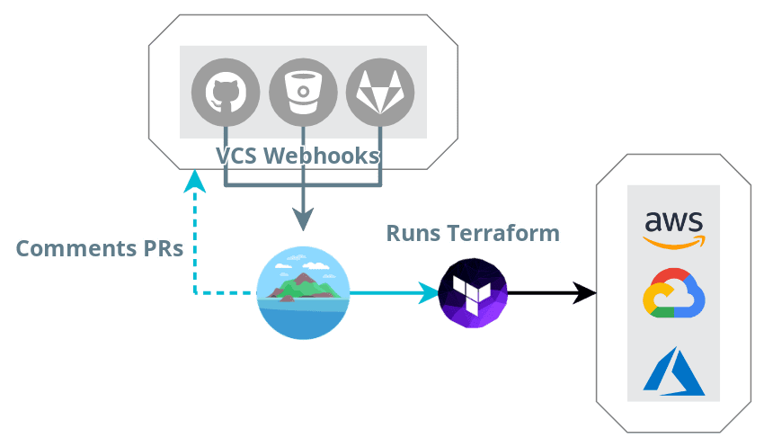

# Docker-Atlantis - Custom build of [Atlantis](https://www.runatlantis.io/) to enable [Terragrunt](https://terragrunt.gruntwork.io/)

## :gear: Atlantis Workflow



## :whale: Docker Usage

```
#--runit--
docker run -it --rm \
    -v ~/.aws:/root/.aws \
    lowess/atlantis
```

For more details please refer to [Atlantis custom workflow](https://www.runatlantis.io/docs/custom-workflows.html)
